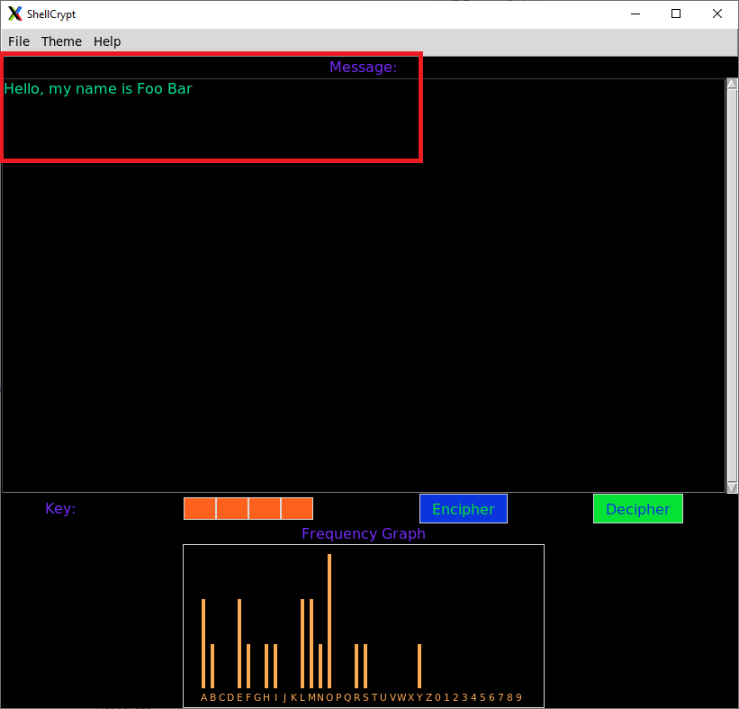
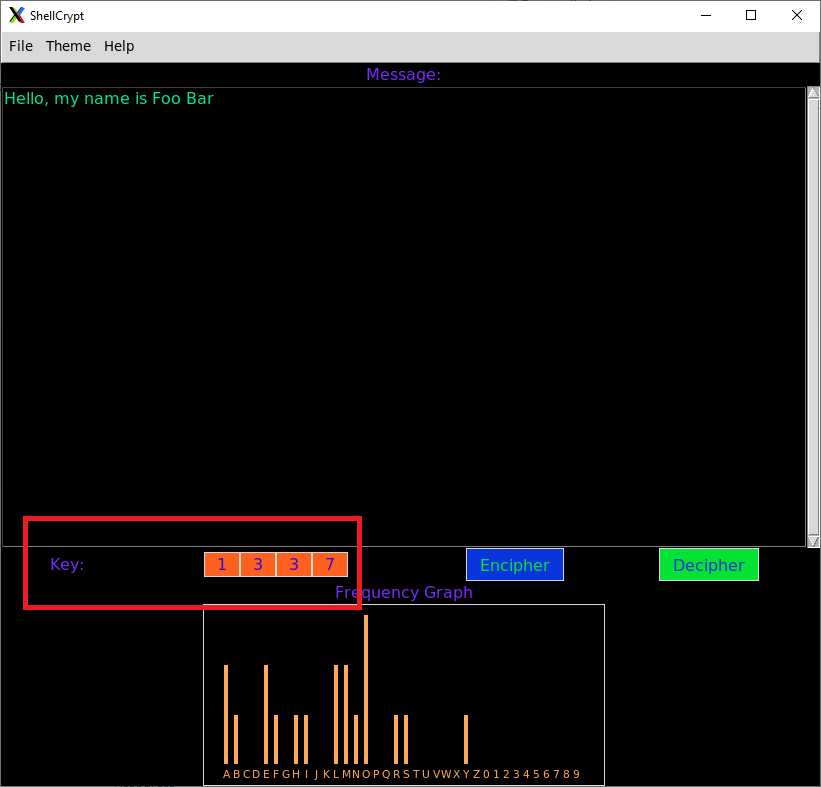
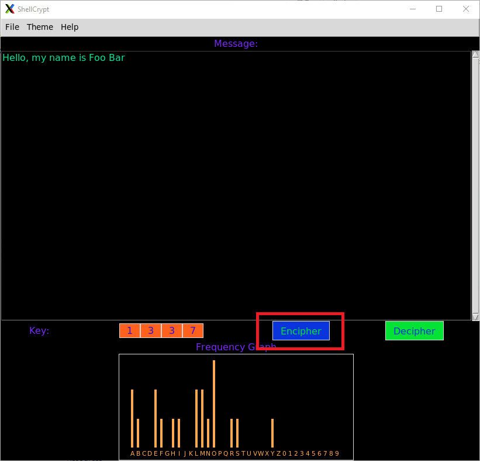
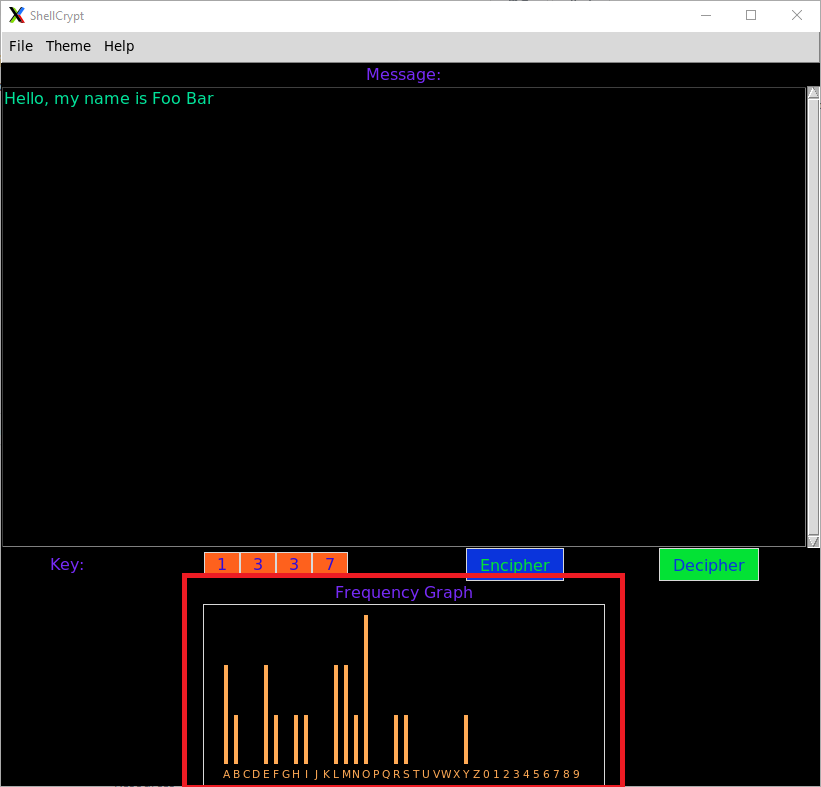
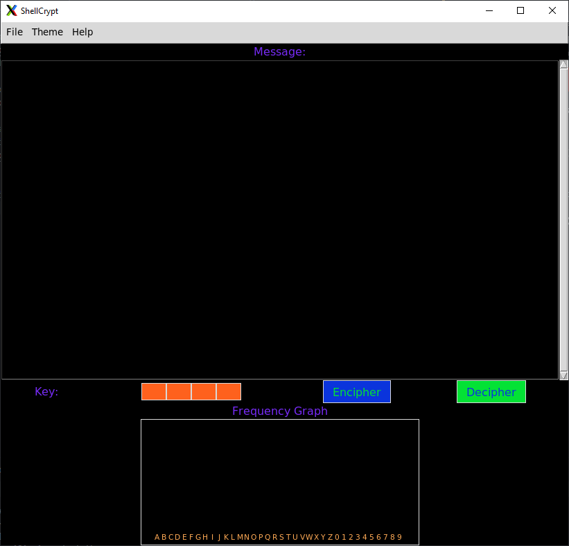
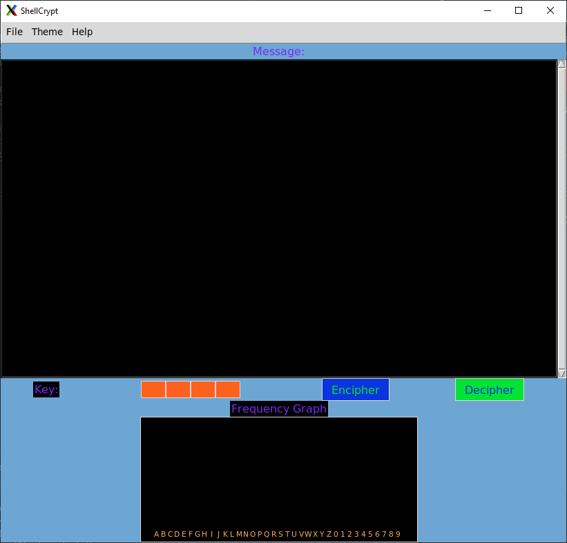
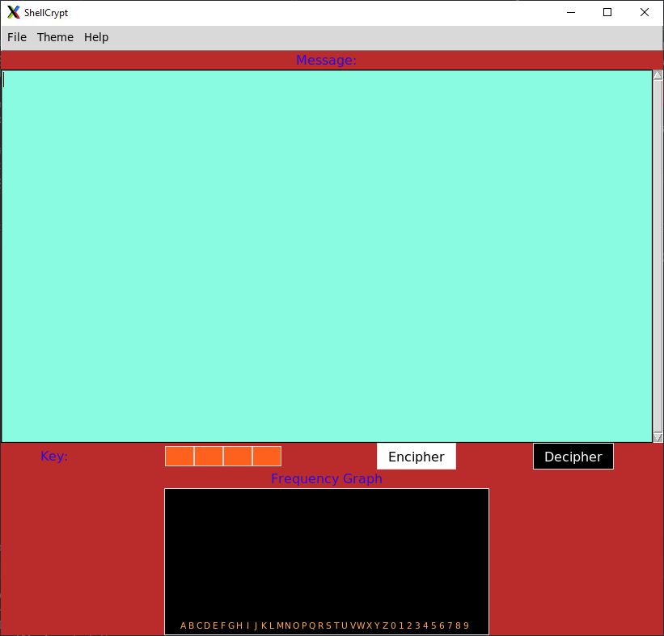
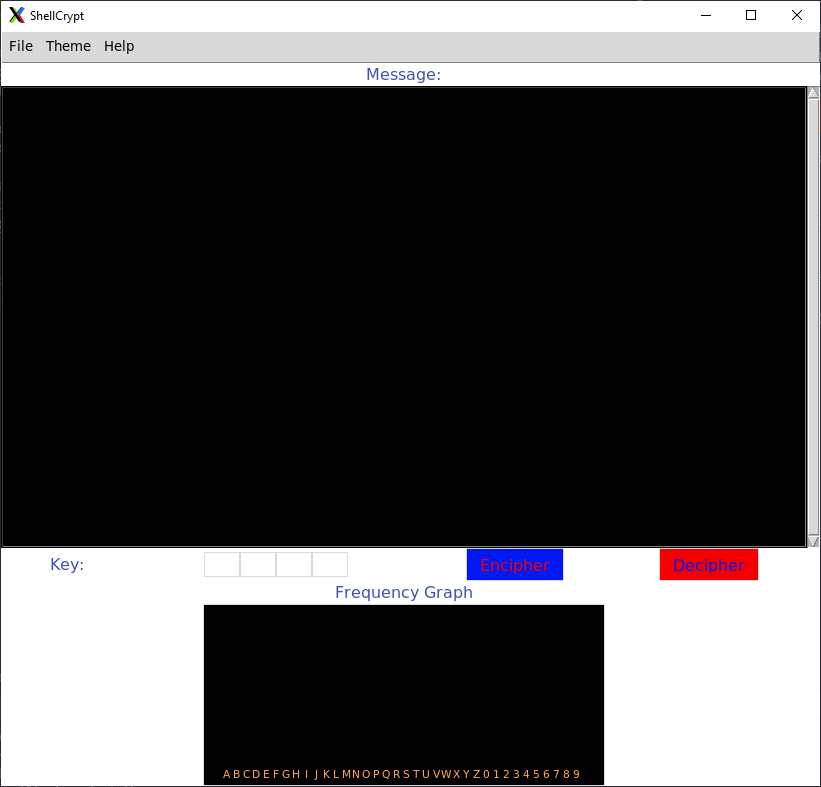

# <p align="center"> ShellCrypt </p>
> A text editor that aims to provide a layer of security with one-time-pad encryption hoping to incorporate the author's intent of being mindful of both the ethics and aesthetics of textual activity.

[](https://python.org)


---

## Installation
### Dependencies
* [Python 2.7](https://www.python.org/downloads/)
* [Tkinter (for Python 2.7)](https://docs.python.org/2/library/tkinter.html#module-Tkinter)

### Run
```
git clone https://github.com/d3fau7t/ShellCrypt.git
cd ShellCrypt
python2 shell.py
```

---

## Usage

Type a message into the "Message Box" to either encipher or decipher:

Set the encryption/decryption key:

Click "Encipher" or "Decipher" to see your encrypted/decrypted message:

View the frequency of letters in your message:


---

## Contributing
Pull requests are welcome. For major changes, please open an issue first to discuss what you would like to change.

Please make sure to update tests as appropriate.

---

## Customization
### Themes
An option to choose from one of four customizable themes: Beach, Lagoon, Desert and Multi Color.
#### Multicolor (Default)

#### Beach

#### Desert

#### Lagoon

